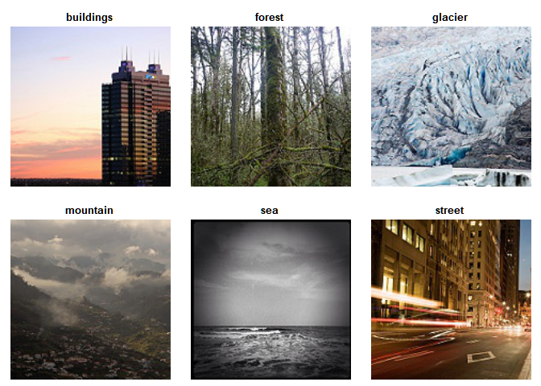
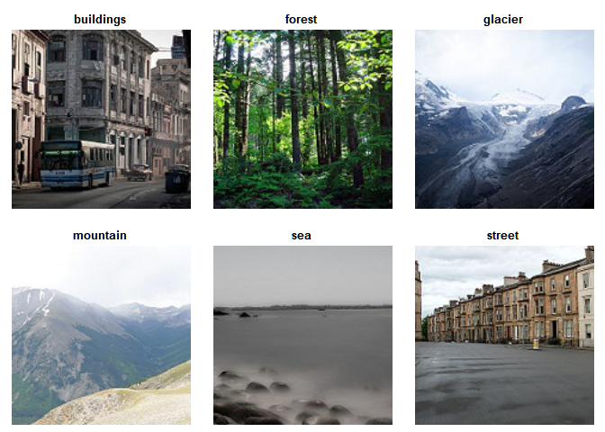
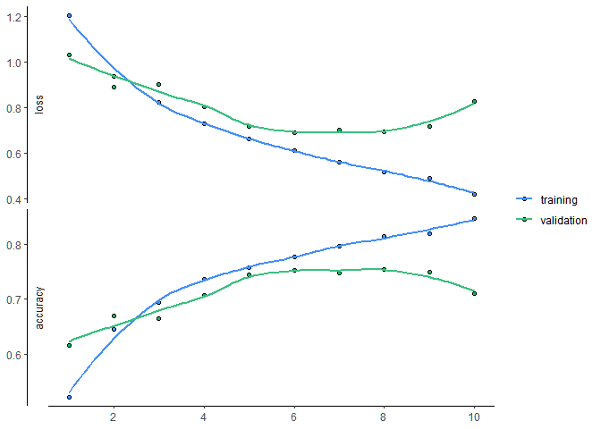
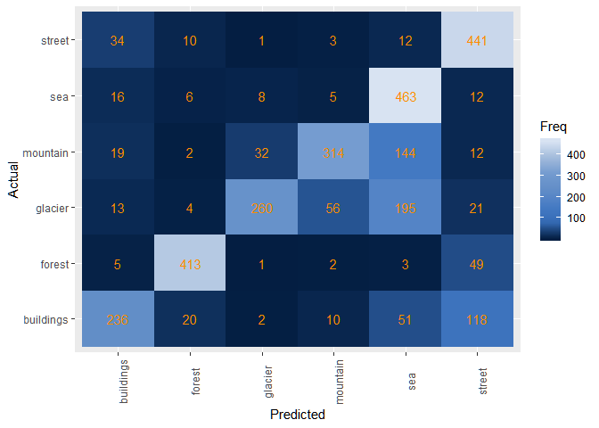
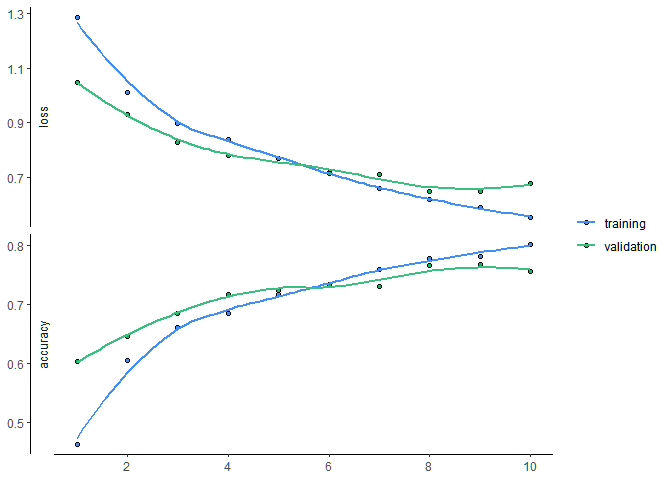
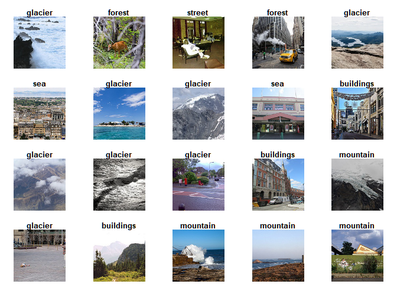
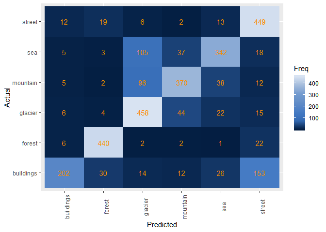

# Table of Contents
1. [Pre-Processing](##Pre-Processing)
    1. [Train Set](##Train)

## Pre-Processing 

## Train

Read in all 6 training files, and combine them into a single list. Use `catlength` to count the number of images in each of the 6 categories. 


```r
setwd("~/Data Science/Project/seg_train")

categories = c("buildings", "forest", "glacier", "mountain", "sea", "street")

files = list()
catlength = NULL

set.seed(1)
for(i in 1:6){
  newfile = categories[i] %>%
    list.files(pattern = "*.jpg", all.files = T, full.names = T, no.. = T) %>%
    sample(10)
  
  files = files %>% append(newfile)
  catlength = append(catlength, length(newfile))
}

files = files %>% unlist()
```

Now, create a list of vectors that accounts for the categories each image belongs to


```r
class_indicator = NULL
for(i in 1:6){
  class_ind = c(rep(i-1, catlength[i]))
  class_indicator = c(class_indicator, class_ind)
}
table(class_indicator)
```

```
## class_indicator
##  0  1  2  3  4  5 
## 10 10 10 10 10 10
```


Plot one image from each of the 6 categories

The vector `each` is set so that we know where the next category begin. The `table(class_list)` function provides how many images are in each category, and since we read in the files sequentially, we can use `cumsum()` to find the cumulative sum, meaning the start of the new category. We need to add 1 to the end because the original cumulative sums only represent the location of the last image in a category. I set this vector only to avoid redoing `plotArrayAsImage` six times. 


```r
setwd("~/Data Science/Project/seg_train")
each = class_indicator %>%
  table() %>%
  as.vector() %>%
  cumsum()

each = c(1, each[1:5]+1)

#add random process:
randomimage = sample(0:min(table(class_indicator)), 1)
each = each + randomimage

par(mfrow=c(2,3))
for(i in 1:6){
  files[each[i]] %>%
    readImage() %>%
    plotArrayAsImage(main = categories[i])
}
```

<!-- -->


Then use the `readImage` function from package `OpenImageR` to load the actual images. And resize the images to 32x32x3 using `resizeImage` and `array_reshape`


```r
setwd("~/Data Science/Project/seg_train")
image_list = list()
for(i in 1:length(files)){
  image_list[[i]] = files[i] %>%
    readImage() %>%
    resizeImage(32,32)
}

rtrain = runif(1, 1:length(image_list))
summary(image_list[[rtrain]])
```

```
##    Min. 1st Qu.  Median    Mean 3rd Qu.    Max. 
##  0.0000  0.1912  0.5412  0.5094  0.8284  1.0000
```

Reshape the data to be used for later CNN: instead of lists of thousands, changed it to one list with 4 dimensions


```r
trainx = image_list %>% 
  array_reshape(c(length(image_list), 32, 32, 3))

trainy = class_indicator %>%
  array_reshape(c(length(class_indicator), 1))

trainall = list(trainx, trainy)

str(trainx)
```

```
##  num [1:60, 1:32, 1:32, 1:3] 0.784 0.384 0.369 0.475 1 ...
```

```r
str(trainy)
```

```
##  num [1:60, 1] 0 0 0 0 0 0 0 0 0 0 ...
```

```r
str(trainall)
```

```
## List of 2
##  $ : num [1:60, 1:32, 1:32, 1:3] 0.784 0.384 0.369 0.475 1 ...
##  $ : num [1:60, 1] 0 0 0 0 0 0 0 0 0 0 ...
```

```r
remove(files, image_list)
```


## Testing

Repeat the same procedures for the testing set. Code explanation same as above. 

Read in


```r
setwd("~/Data Science/Project/seg_test")

files_test = list()
catlength_test = NULL

for(i in 1:6){
  newfile_test = categories[i] %>%
    list.files(pattern = "*.jpg", all.files = T, full.names = T, no.. = T)
  
  files_test = files_test %>% append(newfile_test)
  catlength_test = catlength_test %>% append(length(newfile_test))
}

files_test = unlist(files_test)
```

Set the class/category 


```r
class_indicator_test = NULL
for(i in 1:6){
  class_ind_test = c(rep(i-1, catlength_test[i]))
  class_indicator_test = c(class_indicator_test, class_ind_test)
}
table(class_indicator_test)
```

```
## class_indicator_test
##   0   1   2   3   4   5 
## 437 473 549 523 510 501
```

Plot


```r
setwd("~/Data Science/Project/seg_test")

each_test = class_indicator_test %>%
  table() %>%
  as.vector() %>%
  cumsum()

each_test = c(1, each_test[1:5]+1)

#add random process:
randomimage = sample(0:min(table(class_indicator)), 1)
each_test = each_test + randomimage

par(mfrow=c(2,3))
for(i in 1:6){
  files_test[each_test[i]] %>%
    readImage() %>%
    plotArrayAsImage(main = categories[i])
}
```

<!-- -->


Load the data


```r
setwd("~/Data Science/Project/seg_test")

image_list_test = list()
for(i in 1:length(files_test)){
  image_list_test[[i]] = files_test[i] %>%
    readImage() %>%
    resizeImage(32, 32)
}

rtest = sample(1:length(image_list_test),1)
summary(image_list_test[[rtest]])
```

```
##    Min. 1st Qu.  Median    Mean 3rd Qu.    Max. 
##  0.0000  0.1206  0.2627  0.3902  0.6314  1.0000
```


```r
testx = image_list_test %>% 
  array_reshape(c(length(image_list_test), 32, 32, 3))

testy = class_indicator_test %>%
  array_reshape(c(length(class_indicator_test), 1))

testall = list(testx, testy)

str(testx)
```

```
##  num [1:2993, 1:32, 1:32, 1:3] 0.353 0.431 0.89 0.569 0.157 ...
```

```r
str(testy)
```

```
##  num [1:2993, 1] 0 0 0 0 0 0 0 0 0 0 ...
```

```r
str(testall)
```

```
## List of 2
##  $ : num [1:2993, 1:32, 1:32, 1:3] 0.353 0.431 0.89 0.569 0.157 ...
##  $ : num [1:2993, 1] 0 0 0 0 0 0 0 0 0 0 ...
```

```r
remove(image_list_test)
```

##################################CNN#############################

# CNN

## First Attempt

### Model Fitting/Compiling

Convolutional layers: start with 32 filters with a filter size to be 3 by 3. 

Maxpooling: dim reduction + noise suppressant

Dropout: help with overfitting


```r
model = keras_model_sequential()

model %>%
  layer_conv_2d(filters = 32, 
                kernel_size = c(3,3),
                activation = "relu",
                input_shape = c(32,32,3)) %>%
  layer_max_pooling_2d(pool_size = c(2,2)) %>%
  layer_conv_2d(filters = 64,
                kernel_size = c(3,3),
                activation = "relu") %>%
  layer_max_pooling_2d(pool_size = c(2,2)) %>%
  layer_dropout(rate = 0.25)

summary(model)
```

```
## Model: "sequential"
## ___________________________________________________________________________
## Layer (type)                     Output Shape                  Param #     
## ===========================================================================
## conv2d (Conv2D)                  (None, 30, 30, 32)            896         
## ___________________________________________________________________________
## max_pooling2d (MaxPooling2D)     (None, 15, 15, 32)            0           
## ___________________________________________________________________________
## conv2d_1 (Conv2D)                (None, 13, 13, 64)            18496       
## ___________________________________________________________________________
## max_pooling2d_1 (MaxPooling2D)   (None, 6, 6, 64)              0           
## ___________________________________________________________________________
## dropout (Dropout)                (None, 6, 6, 64)              0           
## ===========================================================================
## Total params: 19,392
## Trainable params: 19,392
## Non-trainable params: 0
## ___________________________________________________________________________
```

flatten: transform 2d array into long 1d array

dense: output = activation(dot(input, kernel) + bias)


```r
model %>% 
  layer_flatten() %>%
  layer_dense(units = 128, activation = "relu") %>%
  layer_dense(units = 6, activation  = "softmax") 
summary(model)
```

```
## Model: "sequential"
## ___________________________________________________________________________
## Layer (type)                     Output Shape                  Param #     
## ===========================================================================
## conv2d (Conv2D)                  (None, 30, 30, 32)            896         
## ___________________________________________________________________________
## max_pooling2d (MaxPooling2D)     (None, 15, 15, 32)            0           
## ___________________________________________________________________________
## conv2d_1 (Conv2D)                (None, 13, 13, 64)            18496       
## ___________________________________________________________________________
## max_pooling2d_1 (MaxPooling2D)   (None, 6, 6, 64)              0           
## ___________________________________________________________________________
## dropout (Dropout)                (None, 6, 6, 64)              0           
## ___________________________________________________________________________
## flatten (Flatten)                (None, 2304)                  0           
## ___________________________________________________________________________
## dense (Dense)                    (None, 128)                   295040      
## ___________________________________________________________________________
## dense_1 (Dense)                  (None, 6)                     774         
## ===========================================================================
## Total params: 315,206
## Trainable params: 315,206
## Non-trainable params: 0
## ___________________________________________________________________________
```

### Compiling


```r
model %>%
  compile(optimizer = "adam",
          loss = "sparse_categorical_crossentropy",
          metrics = "accuracy")
```

### Model Fitting

blue line: based on training data; yellow line: validation data


```r
history <- model %>% 
  fit(
    x = trainx, y = trainy,
    epochs = 10,
    validation_data = testall,
    verbose = 2
  )
beep()
```


### Evaluation


```r
model %>% evaluate(testx, testy, verbose = 0)
```

```
## $loss
## [1] 1.384276
## 
## $accuracy
## [1] 0.4410291
```

building prediction:


```r
pred_att1 = model %>% predict_classes(testx)
tb_att1 = table(Predicted = pred_att1, Actual = testy)
tb_att1
```

```
##          Actual
## Predicted   0   1   2   3   4   5
##         0 123  36  26  55  37  86
##         1  46 348   5   2  15  82
##         2  26  12 150  35  57  61
##         3  48  11  49 191  38  50
##         4 135  13 310 236 346  60
##         5  59  53   9   4  17 162
```


```r
plot(history) + 
  scale_color_manual(values = c("#428ff4", "#39bf7f")) +
  scale_fill_manual(values = c("#428ff4", "#15b367")) +
  theme_classic() +
  theme(title = element_blank(),
        strip.background = element_rect(color = "white"))
```

<!-- -->


### Error Analysis

Mislabelled images


```r
badclass_index = NULL

for(i in 1:length(pred_att1)){
    if(pred_att1[i] != testy[i]){
      ind = i
      badclass_index = c(badclass_index, i)
    }
}

badindex = sample(badclass_index, 20)
beep()
setwd("~/Data Science/Project/seg_test")
par(mfrow=c(4,5))
  for(i in 1:length(badindex)){
      files_test[badindex[i]] %>%
      readImage() %>%
      plotArrayAsImage(main = categories[pred_att1[badindex[i]]+1])
  }
```

<!-- -->

Heatmap


```r
tabheat = tb_att1 %>%
  as.data.frame() 
ggplot(tabheat, aes(x = Predicted, y = Actual, fill = Freq)) +
  geom_tile() +
  scale_fill_gradientn(colors = c("#041E42", "#356bb5", "#457bc4", "#618dc7", 
                                  "#729acf", "#a2bbdb", "#d8e3f2")) +
  scale_x_discrete(labels = categories) +
  scale_y_discrete(labels = categories) +
  geom_text(aes(Predicted, Actual, label = Freq), color = "#ff8c00", size = 4) +
  theme(axis.text.x = element_text(angle = 90))
```

<!-- -->


## Final Attempt

After some trails and errors 

### Model Fitting/Compiling


```r
model = keras_model_sequential()

model %>%
  layer_conv_2d(filters = 32, 
                kernel_size = c(3,3),
                activation = "relu",
                input_shape = c(32,32,3)) %>%
  layer_conv_2d(filters = 32, 
                kernel_size = c(3,3),
                activation = "relu") %>%
  layer_max_pooling_2d(pool_size = c(2,2)) %>%
  layer_dropout(rate = 0.25) %>%
  layer_conv_2d(filters = 64,
                kernel_size = c(3,3),
                activation = "relu") %>%
  layer_conv_2d(filters = 64,
                kernel_size = c(3,3),
                activation = "relu") %>%
  layer_max_pooling_2d(pool_size = c(2,2)) %>%
  layer_dropout(rate = 0.25)

summary(model)
```

```
## Model: "sequential_1"
## ___________________________________________________________________________
## Layer (type)                     Output Shape                  Param #     
## ===========================================================================
## conv2d_2 (Conv2D)                (None, 30, 30, 32)            896         
## ___________________________________________________________________________
## conv2d_3 (Conv2D)                (None, 28, 28, 32)            9248        
## ___________________________________________________________________________
## max_pooling2d_2 (MaxPooling2D)   (None, 14, 14, 32)            0           
## ___________________________________________________________________________
## dropout_1 (Dropout)              (None, 14, 14, 32)            0           
## ___________________________________________________________________________
## conv2d_4 (Conv2D)                (None, 12, 12, 64)            18496       
## ___________________________________________________________________________
## conv2d_5 (Conv2D)                (None, 10, 10, 64)            36928       
## ___________________________________________________________________________
## max_pooling2d_3 (MaxPooling2D)   (None, 5, 5, 64)              0           
## ___________________________________________________________________________
## dropout_2 (Dropout)              (None, 5, 5, 64)              0           
## ===========================================================================
## Total params: 65,568
## Trainable params: 65,568
## Non-trainable params: 0
## ___________________________________________________________________________
```


```r
model %>% 
  layer_flatten() %>%
  layer_dense(units = 256, activation = "relu") %>%
  layer_dropout(rate = 0.5) %>%
  layer_dense(units = 6, activation  = "softmax") 
summary(model)
```

```
## Model: "sequential_1"
## ___________________________________________________________________________
## Layer (type)                     Output Shape                  Param #     
## ===========================================================================
## conv2d_2 (Conv2D)                (None, 30, 30, 32)            896         
## ___________________________________________________________________________
## conv2d_3 (Conv2D)                (None, 28, 28, 32)            9248        
## ___________________________________________________________________________
## max_pooling2d_2 (MaxPooling2D)   (None, 14, 14, 32)            0           
## ___________________________________________________________________________
## dropout_1 (Dropout)              (None, 14, 14, 32)            0           
## ___________________________________________________________________________
## conv2d_4 (Conv2D)                (None, 12, 12, 64)            18496       
## ___________________________________________________________________________
## conv2d_5 (Conv2D)                (None, 10, 10, 64)            36928       
## ___________________________________________________________________________
## max_pooling2d_3 (MaxPooling2D)   (None, 5, 5, 64)              0           
## ___________________________________________________________________________
## dropout_2 (Dropout)              (None, 5, 5, 64)              0           
## ___________________________________________________________________________
## flatten_1 (Flatten)              (None, 1600)                  0           
## ___________________________________________________________________________
## dense_2 (Dense)                  (None, 256)                   409856      
## ___________________________________________________________________________
## dropout_3 (Dropout)              (None, 256)                   0           
## ___________________________________________________________________________
## dense_3 (Dense)                  (None, 6)                     1542        
## ===========================================================================
## Total params: 476,966
## Trainable params: 476,966
## Non-trainable params: 0
## ___________________________________________________________________________
```

### Compiling


```r
model %>%
  compile(optimizer = "adam",
          loss = "sparse_categorical_crossentropy",
          metrics = "accuracy")
```

### Model Fitting

blue line: based on training data; yellow line: validation data


```r
history <- model %>% 
  fit(
    x = trainx, y = trainy,
    epochs = 10,
    validation_data = testall,
    verbose = 2
  )
```


### Evaluation


```r
model %>% evaluate(testx, testy, verbose = 0)
```

```
## $loss
## [1] 1.552242
## 
## $accuracy
## [1] 0.3481457
```

building prediction:


```r
pred_att1 = model %>% predict_classes(testx)
tb_att1 = table(Predicted = pred_att1, Actual = testy)
tb_att1
```

```
##          Actual
## Predicted   0   1   2   3   4   5
##         0  34  15   4   8   8  49
##         1  47 358   5  13  30  76
##         2   9  15  25  10  13  69
##         3  62  22  25 177  34  84
##         4 271  51 490 314 424 199
##         5  14  12   0   1   1  24
```

Accuracy Plot


```r
plot(history) + 
  scale_color_manual(values = c("#428ff4", "#39bf7f")) +
  scale_fill_manual(values = c("#428ff4", "#15b367")) +
  theme_classic() +
  theme(title = element_blank(),
        strip.background = element_rect(color = "white"))
```

<!-- -->


### Error Analysis


```r
badclass_index = NULL

for(i in 1:length(pred_att1)){
    if(pred_att1[i] != testy[i]){
      ind = i
      badclass_index = c(badclass_index, i)
    }
}

badindex = sample(badclass_index, 20)
beep()
setwd("~/Data Science/Project/seg_test")
par(mfrow=c(4,5))
  for(i in 1:length(badindex)){
      files_test[badindex[i]] %>%
      readImage() %>%
      plotArrayAsImage(main = categories[pred_att1[badindex[i]]+1])
  }
```

<!-- -->

Heatmap


```r
tabheat = tb_att1 %>%
  as.data.frame() 
ggplot(tabheat, aes(x = Predicted, y = Actual, fill = Freq)) +
  geom_tile() +
  scale_fill_gradientn(colors = c("#041E42", "#356bb5", "#457bc4", "#618dc7", 
                                  "#729acf", "#a2bbdb", "#d8e3f2")) +
  scale_x_discrete(labels = categories) +
  scale_y_discrete(labels = categories) +
  geom_text(aes(Predicted, Actual, label = Freq), color = "#ff8c00", size = 4) +
  theme(axis.text.x = element_text(angle = 90))
```

<!-- -->

