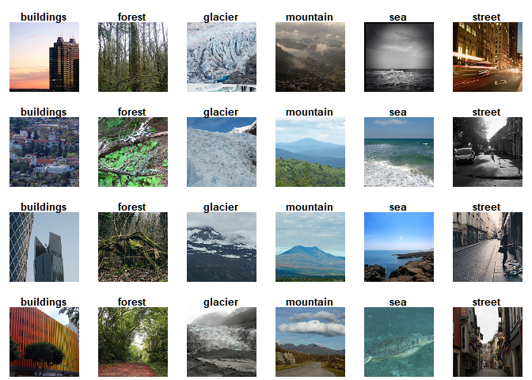

README
================
Yixuan (Sherry) Wu
5/11/2020

This respository hosts the project of image classification. The goal of
the project is to classify natural scenes image data, which is made
available by Intel for an image classification challenge online. The
data are obtained from the Intel Image Classification dataset, which was
originally an online image classification challenge initiated by Intel.
The data are available on Kaggle
(<https://www.kaggle.com/puneet6060/intel-image-classification>).

Here are some examples for the photos randomly selected from each of the
category:

<!-- -->

The original project was for my machine learning class final project.
That project was completed with two other group members, and images were
classified using machine learning techniques, including kNN with cross
validation, random forest with grid search, and support vector machine.
Due to the nature of machine learning methods and limited RAM memory,
the highest accuracy we can get was around 50 percent. The details,
code, output, and report of this project is under the file
`MachineLearning`.

To improve the result, I individually started the second part of this
project, which is to classify these same images using Convolutional
Neural Network. In this project, codes for data pre-processing are
modified and improved from the previous project. Currently, the accuracy
is about 75 percent using only 1000 images from each of the train set
(due to RAM memory limit again), without fine tuning. In near future,
this project will be continously updated to achieve better result. The
details of the project can be found under the file `CNN`.
